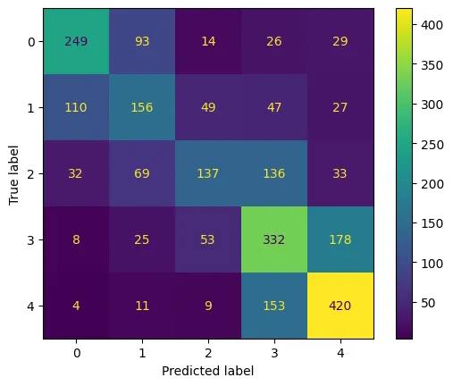

# AutoML with AutoGluon for Multi-Modal Data


<!-- TOC -->

- [AutoML with AutoGluon for Multi-Modal Data](#automl-with-autogluon-for-multi-modal-data)
  - [Sentiment Analysis for 5-star Ratings](#sentiment-analysis-for-5-star-ratings)
    - [Data Preprocessing](#data-preprocessing)
    - [Model Training](#model-training)
    - [Model Evaluation](#model-evaluation)
  - [Binary Classification with the MultiModalPredictor](#binary-classification-with-the-multimodalpredictor)
    - [Data Preprocessing](#data-preprocessing-1)
    - [Model Training](#model-training-1)
    - [Model Evaluation](#model-evaluation-1)

<!-- /TOC -->


__Amazon Product Reviews__:
This is a large crawl of product reviews from Amazon. This dataset contains 82.83 million unique reviews, from around 20 million users.

[Justifying recommendations using distantly-labeled reviews and fined-grained aspects](https://cseweb.ucsd.edu/~jmcauley/datasets/amazon_v2/)
`Jianmo Ni`, `Jiacheng Li`, `Julian McAuley`
_Empirical Methods in Natural Language Processing (EMNLP), 2019_


## Sentiment Analysis for 5-star Ratings

```python
!wget https://github.com/willfry01/Amazon-Reviews-Sentiment/raw/master/preprocessed_kindle_review%20.csv -P dataset
```

```python
# error importing vowpalwabbit
!pip install vowpalwabbit==9.4 
# AttributeError: module 'wandb.sdk' has no attribute 'lib'
!pip install --force shortuuid==1.0.1
# AttributeError: module 'dns.rdtypes' has no attribute 'ANY'
!pip install eventlet==0.33.3
```

```python
from autogluon.tabular import TabularDataset, TabularPredictor
from autogluon.multimodal import MultiModalPredictor
import matplotlib.pyplot as plt
import pandas as pd
from sklearn.metrics import confusion_matrix, ConfusionMatrixDisplay
import seaborn as sns
```

```python
SEED = 42
MODEL_PATH = 'model'
```

### Data Preprocessing

```python
data = TabularDataset('dataset/kindle_review.csv')
data.head(5)
```

|    | Unnamed: 0 | rating | reviewText | summary |
| -- | -- | -- | -- | -- |
| 0 | 0 | 5 | This book was the very first bookmobile book I... | 50 + years ago... |
| 1 | 1 | 1 | When I read the description for this book, I c... | Boring! Boring! Boring! |
| 2 | 2 | 5 | I just had to edit this review. This book is a... | Wiggleliscious/new toy ready/!! |
| 3 | 3 | 5 | I don't normally buy 'mystery' novels because ... | Very good read. |
| 4 | 4 | 5 | This isn't the kind of book I normally read, a... | Great Story! |

```python
data['reviewText'].iloc[0]
# 'This book was the very first bookmobile book I bought when I was in the school book club. I loved the story then and I bet a dollar to a donut I will love it again. If my memory serves, I bought this book in 5th grade. That would have been about 1961. I am looking forward to reliving the memories.'
```

```python
# train / test split
len(data)*0.8
# 9600
```

```python
train_data = data.sample(frac=0.8 , random_state=SEED)
test_data = data.drop(train_data.index)
```

### Model Training

```python
nlp_predictor = TabularPredictor(label='rating', path=MODEL_PATH)
```

```python
# my GPU runs out of VRAM -> deactivate GPU accelleration
nlp_predictor.fit(train_data, hyperparameters='multimodal', num_cpus='auto', num_gpus=0)
# AutoGluon infers your prediction problem is: 'multiclass'
#	5 unique label values:  [4, 3, 5, 2, 1]

# Fitting CountVectorizer for text features: ['reviewText', 'summary']
# 			CountVectorizer fit with vocabulary size = 6873

# Fitting model: WeightedEnsemble_L2 ...
# 	0.5604	 = Validation score   (accuracy)
# 	0.24s	 = Training   runtime
# 	0.0s	 = Validation runtime
# AutoGluon training complete, total runtime = 409.69s ... Best model: "WeightedEnsemble_L2"
```

### Model Evaluation

```python
# run test prediction
test_rating_from_csv = TabularDataset('dataset/test_rating.csv')
nlp_predictor.predict(test_rating_from_csv)
# 0    2
# 1    4
# 2    5
# Name: rating, dtype: int64
```

```python
X_test = test_data.drop(columns=['rating'], axis=1)
y_test = test_data['rating']
```

```python
y_pred = nlp_predictor.predict(X_test)
metrics = nlp_predictor.evaluate_predictions(
    y_true=y_test, y_pred=y_pred, auxiliary_metrics=True)

# Evaluation: accuracy on test data: 0.5391666666666667
# Evaluations on test data:
# {
#     "accuracy": 0.5391666666666667,
#     "balanced_accuracy": 0.5208083196216325,
#     "mcc": 0.4154247244832002
# }
```

```python
confusion = ConfusionMatrixDisplay(
    confusion_matrix=confusion_matrix(y_test, y_pred)
)

confusion.plot(cmap='viridis')

plt.savefig('assets/Multi-Class_Classification_NLP_10.webp', bbox_inches='tight')
```




## Binary Classification with the MultiModalPredictor

```python
# Spam Mails Dataset https://www.kaggle.com/datasets/venky73/spam-mails-dataset
!wget https://github.com/MSc-AI/SpamEmail/raw/main/spam_ham_dataset.csv -P dataset
```

### Data Preprocessing

```python
spam_data = TabularDataset('dataset/spam_ham_dataset.csv')
```

```python
spam_data.head(5)
```

|   | Unnamed: 0 | label | text | label_num |
| -- | -- | -- | -- | -- |
| 0 | 605 | ham | Subject: enron methanol ; meter # : 988291\nth... | 0 |
| 1 | 2349 | ham | Subject: hpl nom for january 9 , 2001\n( see a... | 0 |
| 2 | 3624 | ham | Subject: neon retreat\nho ho ho , we ' re arou... | 0 |
| 3 | 4685 | spam | Subject: photoshop , windows , office . cheap ... | 1 |
| 4 | 2030 | ham | Subject: re : indian springs\nthis deal is to ... | 0 |

```python
# drop second label
spam_data = spam_data.drop(columns=['label_num'], axis=1)
```

```python
spam_data['label'].value_counts()
# ham     3672
# spam    1499
# Name: label, dtype: int64
```

```python
# train / test split
spam_train_data = spam_data.sample(frac=0.8 , random_state=SEED)
spam_test_data = spam_data.drop(spam_train_data.index)
```

### Model Training

```python
mm_predictor = MultiModalPredictor(label='label', path=MODEL_PATH)
```

```python
mm_predictor.fit(spam_train_data)
```

### Model Evaluation

```python
mm_predictor = MultiModalPredictor.load('model/')
```

```python
model_scoring = mm_predictor.evaluate(spam_test_data, metrics=['acc', 'f1'])
print(model_scoring)
# {'acc': 0.965183752417795, 'f1': 0.9400000000000001}
```

```python
test_email1 = "Hi,\n We specialize in developing custom software and related applications and we can develop cost effective and high quality software for you. A brief introduction of what we do is given below:\n Web Design.\n Web Development\n Android & IOS App Development.\n Website Maintenance\n Digital Marketing\n Graphics Designing.\n SEO SMO Adword.\n We are sincerely looking at the prospect of a mutually beneficial relationship with you and your company and to the opportunities the future may bring.\n Regards"
test_email2 = "Tell them I hate them. Is the Space Pope reptilian!? Tell her she looks thin. Hello, little man. I will destroy you! I've got to find a way to escape the horrible ravages of youth. Suddenly, I'm going to the bathroom like clockwork, every three hours. And those jerks at Social Security stopped sending me checks. Now 'I' have to pay them'!"
```

```python
mm_predictor.predict({'text':[test_email1,test_email2]})
# array(['spam', 'ham'], dtype=object)
```

```python
print(mm_predictor.class_labels)
mm_predictor.predict_proba({'text':[test_email1,test_email2]})
# ['ham' 'spam']
# array([[0.02339679, 0.97660315],
#        [0.91861194, 0.08138806]], dtype=float32)
```