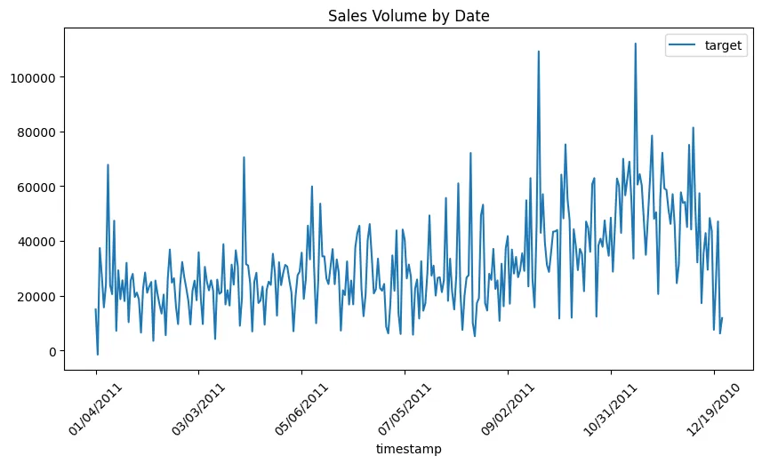
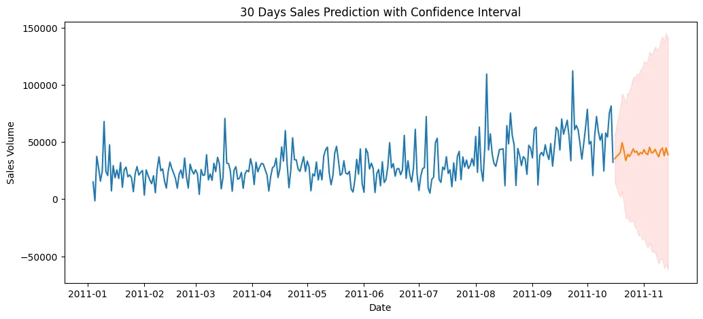
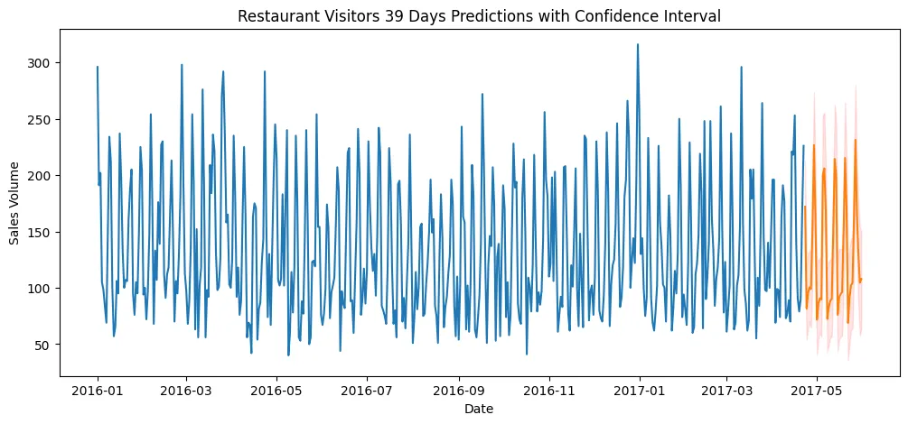
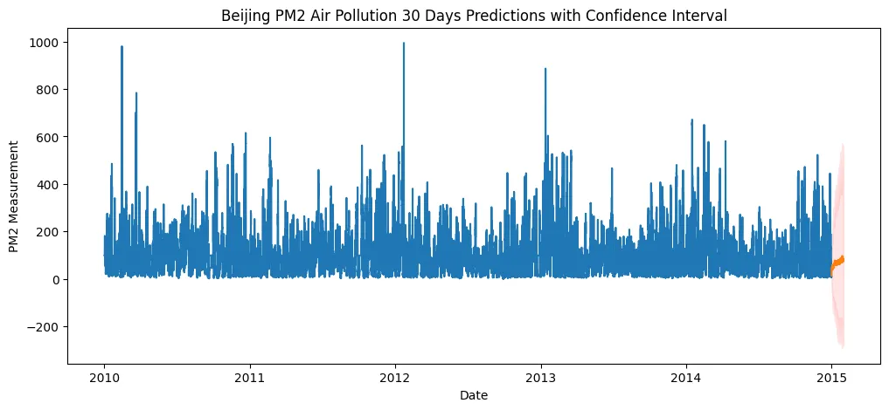

# AutoML with AutoGluon for Timeseries Data

<!-- TOC -->

- [AutoML with AutoGluon for Timeseries Data](#automl-with-autogluon-for-timeseries-data)
  - [Single Variate Forecasting](#single-variate-forecasting)
    - [Data Preprocessing](#data-preprocessing)
    - [Model Training](#model-training)
    - [Model Evaluation](#model-evaluation)
      - [Visualization](#visualization)
  - [Multi Variate Forecasting - Future Covariants](#multi-variate-forecasting---future-covariants)
    - [Data Preprocessing](#data-preprocessing-1)
    - [Model Training](#model-training-1)
    - [Model Predictions](#model-predictions)
      - [Visualization](#visualization-1)
  - [Multi Variate Forecasting - Past Covariants](#multi-variate-forecasting---past-covariants)
    - [Data Preprocessing](#data-preprocessing-2)
    - [Model Training](#model-training-2)
    - [Model Predictions](#model-predictions-1)
      - [Visualization](#visualization-2)

<!-- /TOC -->


```python
# get dataset
!wget https://raw.githubusercontent.com/databricks/Spark-The-Definitive-Guide/master/data/retail-data/all/online-retail-dataset.csv -P dataset
```

## Single Variate Forecasting

```python
from autogluon.timeseries import TimeSeriesDataFrame, TimeSeriesPredictor
import matplotlib.pyplot as plt
from datetime import datetime as dt
import pandas as pd
import seaborn as sns
```

```python
SEED = 42
MODEL_PATH = 'model'
```

### Data Preprocessing

```python
df = pd.read_csv('dataset/online-retail-dataset.csv')
df.head(5)
```

|  | InvoiceNo | StockCode | Description | Quantity | InvoiceDate | UnitPrice | CustomerID | Country |
| -- | -- | -- | -- | -- | -- | -- | -- | -- |
| 0 | 536365 | 85123A | WHITE HANGING HEART T-LIGHT HOLDER | 6 | 12/1/2010 8:26 | 2.55 | 17850.0 | United Kingdom |
| 1 | 536365 | 71053 | WHITE METAL LANTERN | 6 | 12/1/2010 8:26 | 3.39 | 17850.0 | United Kingdom |
| 2 | 536365 | 84406B | CREAM CUPID HEARTS COAT HANGER | 8 | 12/1/2010 8:26 | 2.75 | 17850.0 | United Kingdom |
| 3 | 536365 | 84029G | KNITTED UNION FLAG HOT WATER BOTTLE | 6 | 12/1/2010 8:26 | 3.39 | 17850.0 | United Kingdom |
| 4 | 536365 | 84029E | RED WOOLLY HOTTIE WHITE HEART. | 6 | 12/1/2010 8:26 | 3.39 | 17850.0 | United Kingdom |

```python
df.info()
# <class 'pandas.core.frame.DataFrame'>
# RangeIndex: 541909 entries, 0 to 541908
# Data columns (total 8 columns):
#  #   Column       Non-Null Count   Dtype  
# ---  ------       --------------   -----  
#  0   InvoiceNo    541909 non-null  object 
#  1   StockCode    541909 non-null  object 
#  2   Description  540455 non-null  object 
#  3   Quantity     541909 non-null  int64  
#  4   InvoiceDate  541909 non-null  object 
#  5   UnitPrice    541909 non-null  float64
#  6   CustomerID   406829 non-null  float64
#  7   Country      541909 non-null  object 
# dtypes: float64(2), int64(1), object(5)
# memory usage: 33.1+ MB
```

```python
# only sample last 10.000 items
# df_sample = df.iloc[-10000:]
# take all items
df_sample = df.copy()

# renaming columns
df_sample.rename(columns={'InvoiceNo': 'item_id', 'InvoiceDate': 'timestamp'}, inplace=True)
# create sale total price
df_sample['target'] = df_sample['Quantity'] * df_sample['UnitPrice']
df_sample['item_id'] = 'online_sales'
# create single variant timeseries
df_sample.drop(
    ['StockCode', 'Description', 'CustomerID', 'Country', 'Quantity', 'UnitPrice'],
    axis=1, inplace=True)
df_sample.head(5)
```

|  | item_id | timestamp | target |
| -- | -- | -- | -- |
| 0 | online_sales | 12/1/2010 8:26 | 20.40 |
| 1 | online_sales | 12/1/2010 8:26 | 27.80 |
| 2 | online_sales | 12/1/2010 8:26 | 2.60 |
| 3 | online_sales | 12/1/2010 8:26 | 5.85 |
| 4 | online_sales | 12/1/2010 8:26 | 19.90 |

```python
# reformat timestamp to remove time from date
df_sample['timestamp'] = pd.to_datetime(df_sample['timestamp']).dt.strftime('%m/%d/%Y')
df_sample.head(5)
```

|  | item_id | target | timestamp |
| -- | -- | -- | -- |
| 0 | online_sales | 16.6 | 12/23/2010 |
| 1 | online_sales | 8.5 | 12/23/2010 |
| 2 | online_sales | 20.8 | 12/23/2010 |
| 3 | online_sales | 20.8 | 12/23/2010 |
| 4 | online_sales | 20.8 | 12/23/2010 |

```python
# groupby date and sum() up the sales
df_sample = df_sample.groupby(
    ['item_id', 'timestamp']).sum()

print(df_sample.info())
# MultiIndex: 305 entries, ('online_sales', '01/04/2011') to ('online_sales', '12/23/2010')
df_sample.head(5)
```

|  item_id | timestamp | target |
|  --   |     --     |     --   |
| online_sales | 01/04/2011 | 15584.29 |
|       | 01/05/2011 | 75076.22 |
|       | 01/07/2011 | 81417.78 |
|       | 01/09/2011 | 32131.53 |

```python
df_sample.loc['online_sales']['target'].plot(
    title='Sales Volume by Date',
    figsize=(10,5),
    rot=45,
    legend=True
)
plt.savefig('assets/AutoGluon_AutoML_TimeSeries_01.webp', bbox_inches='tight')
```



```python
df_sample.to_csv('dataset/single_variant_ts.csv', index=True)
```

### Model Training


> ValueError: Frequency not provided and cannot be inferred. This is often due to the time index of the data being 
irregularly sampled. Please ensure that the data set used has a uniform time index, or create the 
`TimeSeriesPredictor` setting `ignore_time_index=True`.

AutoGluon does not like irregular timeseries __AT ALL__... I manually fixed the `timestamp` column with regular, daily interval. Docs recommend auto-filling for missing data before model training.

```python
train_data = TimeSeriesDataFrame('dataset/single_variant_ts.csv')
train_data.describe()
```

|  | target |
| -- | -- |
| count | 305.000000 |
| mean | 31959.829292 |
| std | 17414.261664 |
| min | -1566.230000 |
| 25% | 20728.140000 |
| 50% | 27978.410000 |
| 75% | 42912.400000 |
| max | 112141.110000 |

```python
# create a predictor for 30 days (30 row in dataset) forcast
sv_predictor = TimeSeriesPredictor(
    prediction_length=30,
    path=MODEL_PATH,
    target='target',
    eval_metric='sMAPE'
)
```

```python
sv_predictor.fit(
    train_data,
    time_limit=800,
    presets="medium_quality"
)

# Training complete. Models trained: ['Naive', 'SeasonalNaive', 'Theta', 'AutoETS', 'RecursiveTabular', 'DeepAR', 'WeightedEnsemble']
# Total runtime: 146.36 s
# Best model: WeightedEnsemble
# Best model score: -0.2301
```

```python
sv_predictor.fit_summary()
```

Estimated performance of each model:

|   |     model | score_val | pred_time_val | fit_time_marginal | fit_order |
|  -- |     -- | -- | -- | -- | -- |
| 0 | WeightedEnsemble | -0.321595 | 1.042651 | 1.881647 | 7 |
| 1 | RecursiveTabular | -0.321595 | 1.042651 | 0.757291 | 5 |
| 2 | DeepAR | -0.384756 | 0.095033 | 69.751811 | 6 |
| 3 | AutoETS | -0.385364 | 22.865800 | 0.012004 | 4 |
| 4 | Theta | -0.397785 | 24.269135 | 0.009619 | 3 |
| 5 | SeasonalNaive | -0.403544 | 5.162711 | 0.010179 | 2 |
| 6 | Naive | -0.403544 | 5.572433 | 0.009085 | 1 |
_Number of models trained: 7_
_Types of models trained:_
`{'MultiWindowBacktestingModel', 'TimeSeriesGreedyEnsemble'}`


### Model Evaluation

```python
# return a 1 month forcast on the training data
sv_predictions = sv_predictor.predict(train_data, random_seed=SEED)
```

```python
sv_predictions
```

|         |    | mean | 0.1 | 0.2 | 0.3 | 0.4 | 0.5 | 0.6 | 0.7 | 0.8 | 0.9 |
| --      | -- | -- | -- | -- | -- | -- | -- | -- | -- | -- | -- |
| item_id      | timestamp  |  |  |  |  |  |  |  |  |  |  |									
| online_sales | 2011-10-16 | 35231.549892 | 14821.287291 | 21889.080854 | 26885.810628 | 31139.108555 | 35389.176845 | 39525.311786 | 43747.076754 | 48715.574839 | 55619.827997 |
|              | 2011-10-17 | 37319.098400 | 9315.489680 | 18992.518673 | 25927.428089 | 31800.990269 | 37256.964611 | 42685.962390 | 48685.278476 | 55741.918605 | 65278.986905 |
|              | 2011-10-18 | 38623.633612 | 5142.371285 | 16610.764052 | 24909.974641 | 32018.253338 | 38569.692694 | 45201.922577 | 52390.855571 | 60646.930906 | 72387.928409 |
|              | 2011-10-19 | 40741.301758 | 1946.154973 | 15539.068760 | 25137.953113 | 33223.044572 | 40765.606934 | 48463.165389 | 56628.990736 | 66077.743741 | 79722.836483 |
|              | 2011-10-20 | 49296.101707 | 6303.232915 | 21458.815514 | 31910.941266 | 40964.792632 | 49394.712059 | 57908.461563 | 66841.601504 | 77474.686240 | 92186.915812 |
|              | 2011-10-21 | 42399.179004 | -4222.418692 | 11966.114749 | 23324.147218 | 33287.622759 | 42457.754199 | 51587.049946 | 61400.403661 | 72842.296970 | 88931.093472 |
|              | 2011-10-22 | 33619.926637 | -17087.154419 | 364.144617 | 12901.404480 | 23491.862364 | 33662.238893 | 43520.884464 | 54164.964907 | 66630.573647 | 84037.471194 |
|              | 2011-10-23 | 39042.384772 | -14703.540432 | 3853.552955 | 17218.430626 | 28519.710014 | 39090.598639 | 49763.392538 | 60939.668264 | 74324.111121 | 92676.374673 |
|              | 2011-10-24 | 37314.733017 | -19270.824930 | 233.744114 | 14092.680263 | 26011.109933 | 37258.663681 | 48286.522116 | 60254.494754 | 74152.628169 | 93725.394967 |
|              | 2011-10-25 | 40035.277581 | -19730.031575 | 823.364529 | 15754.378083 | 28379.185360 | 40095.125237 | 51768.504080 | 64369.746415 | 78969.545369 | 99392.125068 |
|              | 2011-10-26 | 43809.551647 | -18581.300915 | 2831.155428 | 18233.929143 | 31493.221895 | 43799.325572 | 56059.960500 | 69262.074053 | 84846.687611 | 106247.592685 |
|              | 2011-10-27 | 40978.233969 | -24604.018712 | -2246.682396 | 14204.335705 | 28124.915072 | 41120.107016 | 53865.685435 | 67632.214997 | 83850.112737 | 106498.851884 |
|              | 2011-10-28 | 41743.192227 | -26024.978536 | -2645.385307 | 14166.811130 | 28273.284258 | 41561.178311 | 54943.112404 | 69180.700278 | 86004.451402 | 109515.329421 |
|              | 2011-10-29 | 38315.939169 | -32037.733749 | -7961.047361 | 9530.292590 | 24433.420394 | 38430.213583 | 52199.831968 | 67014.321833 | 84580.597330 | 108781.710477 |
|              | 2011-10-30 | 40790.730787 | -31714.294692 | -6632.032918 | 11250.135692 | 26624.395493 | 40830.333814 | 55083.397136 | 70254.854690 | 88116.212266 | 113018.777994 |
|              | 2011-10-31 | 39601.428364 | -35269.325656 | -9299.692907 | 9073.426874 | 24982.993094 | 39702.658833 | 54402.247423 | 70171.210127 | 88614.257154 | 114229.722423 |
|              | 2011-11-01 | 43321.091336 | -33495.290752 | -7238.416761 | 11718.451027 | 27982.345746 | 43267.875515 | 58529.011730 | 74809.030961 | 93805.173651 | 120492.849400 |
|              | 2011-11-02 | 39873.310897 | -39638.237188 | -12259.488831 | 7259.635658 | 24107.774345 | 39944.400252 | 55573.550817 | 72172.974172 | 91871.915068 | 119270.200045 |
|              | 2011-11-03 | 38897.212691 | -42509.220460 | -14725.370733 | 5465.492686 | 22784.085743 | 38756.254195 | 54814.426553 | 72198.679766 | 92621.915745 | 120534.229094 |
|              | 2011-11-04 | 45310.748490 | -37919.694783 | -9357.164960 | 11175.946162 | 28815.300995 | 45152.634721 | 61626.068300 | 79239.016639 | 99980.063552 | 128811.104239 |
|              | 2011-11-05 | 40524.113111 | -45095.463685 | -15760.925828 | 5668.926472 | 23679.488279 | 40503.121411 | 57398.500638 | 75497.467474 | 96633.997752 | 126117.225307 |
|              | 2011-11-06 | 40806.692620 | -46676.736613 | -16544.120931 | 5068.030397 | 23563.217104 | 40845.487542 | 58063.833664 | 76565.798203 | 98222.894111 | 128465.220975 |
|              | 2011-11-07 | 43503.676450 | -46255.703438 | -15315.077993 | 6965.648074 | 25902.252457 | 43336.311215 | 61053.512552 | 80111.716545 | 102295.131332 | 133194.560977 |
|              | 2011-11-08 | 39830.233893 | -51545.615185 | -20027.924158 | 2662.824619 | 21906.346012 | 39980.482428 | 58006.295602 | 77399.156839 | 99888.163672 | 131151.589197 |
|              | 2011-11-09 | 36990.513044 | -56523.526649 | -24495.447993 | -1066.945972 | 18732.001915 | 37151.279157 | 55520.419680 | 75331.859267 | 98382.970785 | 130468.262942 |
|              | 2011-11-10 | 42656.625332 | -52222.084277 | -19714.514788 | 3802.223665 | 23887.046793 | 42525.441250 | 61225.057142 | 81332.468161 | 104820.044505 | 137808.305522 |
|              | 2011-11-11 | 44756.329828 | -52548.031615 | -18656.197064 | 5288.754038 | 25734.360637 | 44828.240961 | 63986.351020 | 84378.816506 | 108611.618683 | 142140.108263 |
|              | 2011-11-12 | 37905.655743 | -60991.102805 | -27099.347751 | -2388.499412 | 18511.776221 | 38050.389629 | 57546.974229 | 78416.261580 | 102719.966853 | 136415.925032 |
|              | 2011-11-13 | 44715.800505 | -55633.323514 | -20782.285358 | 3913.667987 | 24980.451031 | 44809.798552 | 64605.937576 | 85704.112222 | 110433.920792 | 144866.205041 |
|              | 2011-11-14 | 38863.458282 | -62877.590928 | -28234.112477 | -2844.261356 | 18802.531926 | 38951.660430 | 59170.908563 | 80678.533877 | 105966.185779 | 141098.465744 |


#### Visualization

```python
def plot_predictions(train_data, predictions, item_id, target_column, titel, ylabel):
    plt.figure(figsize=(12,5))
    plt.title(titel)
    plt.xlabel('Date')
    plt.ylabel(ylabel)
    # timeseries data
    y_train = train_data.loc[item_id][target_column]
    plt.plot(y_train, label="Timeseries Data")
    # forcast data
    y_pred = predictions.loc[item_id]
    plt.plot(y_pred['mean'], label="Mean Forecast")
    # confidence intervals
    plt.fill_between(
        y_pred.index , y_pred['0.1'], y_pred['0.9'],
        color='red', alpha=0.1, label='10%-90% Confidence Range'
    )
```

```python
plot_predictions(
    train_data, sv_predictions,
    item_id='online_sales', target_column='target',
    titel='30 Days Sales Prediction with Confidence Interval',
    ylabel = 'Sales Volume'
)
plt.savefig('assets/AutoGluon_AutoML_TimeSeries_02.webp', bbox_inches='tight')
```




## Multi Variate Forecasting - Future Covariants

Add known factors that affected your time series data in the past to future prediction - e.g. holidays on restaurant revenues.

```python
# get dataset
!wget https://github.com/DaviRolim/datasets/raw/master/RestaurantVisitors.csv -P dataset
```

### Data Preprocessing

```python
df = pd.read_csv('dataset/RestaurantVisitors.csv')
df.tail(5)
# dataset contains unknowns -> will be used for prediction
```

|  | date | weekday | holiday | holiday_name | rest1 | rest2 | rest3 | rest4 | total |
| --  | -- | -- | -- | -- | -- | -- | -- | -- | -- |
| 512 | 5/27/2017 | Saturday | 0 | na | NaN | NaN | NaN | NaN | NaN |
| 513 | 5/28/2017 | Sunday | 0 | na | NaN | NaN | NaN | NaN | NaN |
| 514 | 5/29/2017 | Monday | 1 | Memorial Day | NaN | NaN | NaN | NaN | NaN |
| 515 | 5/30/2017 | Tuesday | 0 | na | NaN | NaN | NaN | NaN | NaN |
| 516 | 5/31/2017 | Wednesday | 0 | na | NaN | NaN | NaN | NaN | NaN |

```python
df.info()
# there are `517` entries but only `478` have a total
```

|    | Column | Non-Null Count | Dtype |
| -- | -- | -- | -- |
 | 0 |date |  |   517 non-null | object  |
 | 1 |weekday |    517 non-null | object  |
 | 2 |holiday |    517 non-null | int64   |
 | 3 |holiday_name | 517 non-null | object  |
 | 4 |rest1  |  478 non-null | float64 |
 | 5 |rest2  |  478 non-null | float64 |
 | 6 |rest3  |  478 non-null | float64 |
 | 7 |rest4  |  478 non-null | float64 |
 | 8 |total  |  478 non-null | float64 |

```python
df_sample = df.copy()

# renaming columns
df_sample.rename(columns={'total': 'target', 'date': 'timestamp'}, inplace=True)
df_sample['item_id'] = 'restaurant_visitors'

# get numeric representation of weekday from timestamp
datetimes = pd.to_datetime(df_sample['timestamp'])
df_sample['timestamp'] = datetimes
df_sample['weekday'] = datetimes.dt.day_of_week

# drop not needed
df_sample.drop(
    ['rest1', 'rest2', 'rest3', 'rest4', 'holiday_name'],
    axis=1, inplace=True)

df_sample.tail(5)
```

|  | timestamp | weekday | holiday | target | item_id |
| -- | -- | -- | -- | -- | -- |
| 512 | 2017-05-27 | 5 | 0 | NaN | restaurant_visitors |
| 513 | 2017-05-28 | 6 | 0 | NaN | restaurant_visitors |
| 514 | 2017-05-29 | 0 | 1 | NaN | restaurant_visitors |
| 515 | 2017-05-30 | 1 | 0 | NaN | restaurant_visitors |
| 516 | 2017-05-31 | 2 | 0 | NaN | restaurant_visitors |

```python
# split missing data for prediction
df_sample.iloc[:478].to_csv('dataset/mv_known_series.csv', index=False)
df_sample.iloc[478:].drop('target',axis=1).to_csv('dataset/mv_unknown_series.csv', index=False)
```

### Model Training

```python
train_data = TimeSeriesDataFrame('dataset/mv_known_series.csv')
train_data.head(5)
```

|  |  | weekday | holiday | target |
| -- | -- | -- | -- | -- |
| item_id | timestamp |  |  |  |
| restaurant_visitors | 2016-01-01 | 4 | 1 | 296.0 |
|  | 2016-01-02 | 5 | 0 | 191.0 |
|  | 2016-01-03 | 6 | 0 | 202.0 |
|  | 2016-01-04 | 0 | 0 | 105.0 |
|  | 2016-01-05 | 1 | 0 | 98.0 |

```python
# create a predictor for the length of the unknown series
mv_predictor = TimeSeriesPredictor(
    prediction_length=len(df_sample.iloc[478:]),
    path=MODEL_PATH,
    target='target',
    known_covariates_names = ['weekday', 'holiday'],
    eval_metric='sMAPE'
)
```

```python
mv_predictor.fit(
    train_data,
    time_limit=800,
    presets="high_quality"
)

# Training complete. Models trained: ['Naive', 'SeasonalNaive', 'Theta', 'AutoETS', 'RecursiveTabular', 'DeepAR', 'TemporalFusionTransformer', 'PatchTST', 'AutoARIMA', 'WeightedEnsemble']
# Total runtime: 470.02 s
# Best model: WeightedEnsemble
# Best model score: -0.1501
```

### Model Predictions

```python
future_series = TimeSeriesDataFrame('dataset/mv_unknown_series.csv')
```

```python
future_series.head(5)
```

|  |  | weekday | holiday |
| -- | -- | -- | -- |
| item_id | timestamp |  |  |
| restaurant_visitors | 2017-04-23 | 6 | 0 |
|  | 2017-04-24 | 0 | 0 |
|  | 2017-04-25 | 1 | 0 |
|  | 2017-04-26 | 2 | 0 |
|  | 2017-04-27 | 3 | 0 |

```python
mv_predictions = mv_predictor.predict(train_data, known_covariates=future_series, random_seed=SEED)
```

#### Visualization

```python
plot_predictions(
    train_data, mv_predictions,
    item_id='restaurant_visitors', target_column='target',
    titel='Restaurant Visitors 39 Days Predictions with Confidence Interval',
    ylabel = 'Restaurant Revenue'
)
plt.savefig('assets/AutoGluon_AutoML_TimeSeries_03.webp', bbox_inches='tight')
```




## Multi Variate Forecasting - Past Covariants

The Air Quality dataset reports on the weather and the level of pollution each hour for five years at the US embassy in Beijing, China. The data includes the date-time, the PM2.5 concentration, and the weather information including dew point, temperature, pressure, wind direction, wind speed and the cumulative number of hours of snow and rain.

```python
# get dataset
!wget https://raw.githubusercontent.com/jyoti0225/Air-Pollution-Forecasting/master/AirPollution.csv -P dataset
```

### Data Preprocessing

```python
# datetime is split up into 4 columns => combine
def parse(x):
    return dt.strptime(x, '%Y %m %d %H')
```

```python
df = pd.read_csv('dataset/AirPollution.csv', date_parser=parse,parse_dates=[
    ['year', 'month', 'day', 'hour']
])

df.head(5)
```

| | year_month_day_hour | No | pm2.5 | DEWP | TEMP | PRES | cbwd | Iws | Is | Ir |
| -- | -- | -- | -- | -- | -- | -- | -- | -- | -- | -- |
| 0 | 2010-01-01 00:00:00 | 1 | NaN | -21 | -11.0 | 1021.0 | NW | 1.79 | 0 | 0 |
| 1 | 2010-01-01 01:00:00 | 2 | NaN | -21 | -12.0 | 1020.0 | NW | 4.92 | 0 | 0 |
| 2 | 2010-01-01 02:00:00 | 3 | NaN | -21 | -11.0 | 1019.0 | NW | 6.71 | 0 | 0 |
| 3 | 2010-01-01 03:00:00 | 4 | NaN | -21 | -14.0 | 1019.0 | NW | 9.84 | 0 | 0 |
| 4 | 2010-01-01 04:00:00 | 5 | NaN | -20 | -12.0 | 1018.0 | NW | 12.97 | 0 | 0 |

```python
df.info()
# dataset contains missing pm2.5 values

#  #   Column               Non-Null Count  Dtype         
# ---  ------               --------------  -----         
#  0   year_month_day_hour  43824 non-null  datetime64[ns]
#  1   No                   43824 non-null  int64         
#  2   pm2.5                41757 non-null  float64       
#  3   DEWP                 43824 non-null  int64         
#  4   TEMP                 43824 non-null  float64       
#  5   PRES                 43824 non-null  float64       
#  6   cbwd                 43824 non-null  object        
#  7   Iws                  43824 non-null  float64       
#  8   Is                   43824 non-null  int64         
#  9   Ir                   43824 non-null  int64 
```

```python
df_sample = df.copy()

# one-hot encode wind direction
one_hot_wind = pd.get_dummies(df['cbwd'], drop_first=True)
df_sample = pd.concat([df, one_hot_wind], axis=1, join="inner")

# renaming columns
df_sample.rename(columns={
    'year_month_day_hour': 'timestamp',
    'pm2.5': 'target',
    'DEWP': 'dew_point',
    'TEMP': 'temperature',
    'PRES': 'pressure',
    'NW': 'wind_direction_nw',
    'SE': 'wind_direction_se',
    'cv': 'wind_direction_cv',
    'Iws': 'wind_speed',
    'Is': 'snow',
    'Ir': 'rain'}, inplace=True)

# add item_id
df_sample['item_id'] = 'pm2_pollution'

# fill missing targets with mean()
df_sample['target'] = df_sample['target'].fillna(df_sample['target'].mean())

# make datetime object
datetimes = pd.to_datetime(df_sample['timestamp'])
df_sample['timestamp'] = datetimes
df_sample['weekday'] = datetimes.dt.day_of_week

# drop not needed
df_sample.drop(['No', 'cbwd'], axis=1, inplace=True)

df_sample.head(5)
```

|  | timestamp | target | dew_point | temperature | pressure | wind_speed | snow | rain | wind_direction_nw | wind_direction_se | wind_direction_cv | item_id | weekday |
| -- | -- | -- | -- | -- | -- | -- | -- | -- | -- | -- | -- | -- | -- |
| 0 | 2010-01-01 00:00:00 | 98.613215 | -21 | -11.0 | 1021.0 | 1.79 | 0 | 0 | 1 | 0 | 0 | pm2_pollution | 4 |
| 1 | 2010-01-01 01:00:00 | 98.613215 | -21 | -12.0 | 1020.0 | 4.92 | 0 | 0 | 1 | 0 | 0 | pm2_pollution | 4 |
| 2 | 2010-01-01 02:00:00 | 98.613215 | -21 | -11.0 | 1019.0 | 6.71 | 0 | 0 | 1 | 0 | 0 | pm2_pollution | 4 |
| 3 | 2010-01-01 03:00:00 | 98.613215 | -21 | -14.0 | 1019.0 | 9.84 | 0 | 0 | 1 | 0 | 0 | pm2_pollution | 4 |
| 4 | 2010-01-01 04:00:00 | 98.613215 | -20 | -12.0 | 1018.0 | 12.97 | 0 | 0 | 1 | 0 | 0 | pm2_pollution | 4 |

```python
df_sample.to_csv('dataset/bj_airpollution.csv', index=False)
```

### Model Training

```python
train_data = TimeSeriesDataFrame('dataset/bj_airpollution.csv')
train_data.head(5)
```

|         |           | target | dew_point | temperature | pressure | wind_speed | snow | rain | wind_direction_nw | wind_direction_se | wind_direction_cv | weekday |
| -- | -- | -- | -- | -- | -- | -- | -- | -- | -- | -- | -- | --  |
| item_id | timestamp |  |  |  |  |  |  |  | |  |  |   |
| pm2_pollution | 2010-01-01 00:00:00 | 98.613215 | -21 | -11.0 | 1021.0 | 1.79 | 0 | 0 | 1 | 0 | 0 | 4 |
| | 2010-01-01 01:00:00 | 98.613215 | -21 | -12.0 | 1020.0 | 4.92 | 0 | 0 | 1 | 0 | 0 | 4 |
| | 2010-01-01 02:00:00 | 98.613215 | -21 | -11.0 | 1019.0 | 6.71 | 0 | 0 | 1 | 0 | 0 | 4 |
| | 2010-01-01 03:00:00 | 98.613215 | -21 | -14.0 | 1019.0 | 9.84 | 0 | 0 | 1 | 0 | 0 | 4 |
| | 2010-01-01 04:00:00 | 98.613215 | -20 | -12.0 | 1018.0 | 12.97 | 0 | 0 | 1 | 0 | 0 | 4 |

```python
# 30-day predictor
bj_predictor = TimeSeriesPredictor(
    prediction_length=24*30,
    path=MODEL_PATH,
    target='target',
    eval_metric='sMAPE'
)
```

```python
bj_predictor.fit(
    train_data,
    presets="high_quality"
)

# Fitting simple weighted ensemble.
# 	-0.8465       = Validation score (-sMAPE)
# 	3.16    s     = Training runtime
# 	40.20   s     = Validation (prediction) runtime
# Training complete. Models trained: ['Naive', 'SeasonalNaive', 'Theta', 'AutoETS', 'RecursiveTabular', 'DeepAR', 'PatchTST', 'AutoARIMA', 'WeightedEnsemble']
# Total runtime: 693.53 s
# Best model: WeightedEnsemble
# Best model score: -0.8465
```

### Model Predictions

```python
bj_predictions = bj_predictor.predict(train_data, random_seed=SEED)
```

#### Visualization

```python
plot_predictions(
    train_data, bj_predictions,
    item_id='pm2_pollution', target_column='target',
    titel='Beijing PM2 Air Pollution 30 Days Predictions with Confidence Interval',
    ylabel = 'PM2 Measurement'
)
plt.savefig('assets/AutoGluon_AutoML_TimeSeries_04.webp', bbox_inches='tight')
```

